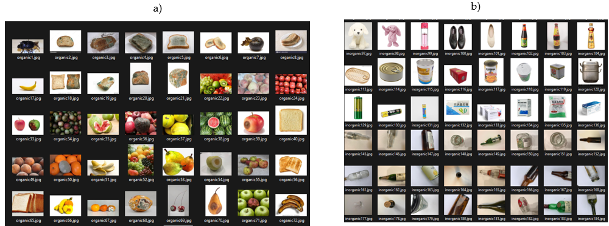

# ResycleNet dataset

## Creación del conjunto de datos

Para la conformación del dataset de residuos se consultaron múltiples bases de datos públicas, como TrashNet 993 (Thung 2017) , Garbage_Huawei 548, (Sekar 2018) 731, (Kunwar 2024) 175, (Mohamed 2020) 275 y de Garbage Pictures for Classification (https://www.kaggle.com/datasets/mascot9183/garbage-pictures-for-classification) 339.

Cada imagen fue inspeccionada para eliminar duplicados y asegurar que no hubiera repeticiones entre las fuentes. Se utilizaron técnicas de hash basadas en el contenido de las imágenes para identificar y filtrar imágenes similares. Adicionalmente, las imágenes se etiquetaron cuidadosamente en las categorías de orgánicos e inorgánicos.

El dataset final incluye un total de 3208 imágenes, divididas en 1574 imágenes para la clase de residuos orgánicos y 1634 imágenes para la clase de residuos inorgánicos, con un equilibrio proporcional entre ambas categorías.

Para asegurar la uniformidad en el procesamiento, las imágenes fueron convertidas al formato RGB, independientemente de su formato original. Esto permitió garantizar que cada imagen tuviera tres canales consistentes, esenciales para ser procesados por la arquitectura de la red neuronal.

## Información de procedencia y cantidad de imágenes por conjunto de datos.

| Nombre Dataset                      | Enlace                                                                       | Cantidad imágenes |
|-------------------------------------|------------------------------------------------------------------------------|-------------------|
| TrashNet                            | https://github.com/garythung/trashnet                                        |       993         |
| Garbage_HuaWei                      | https://www.kaggle.com/datasets/xiaohoua/garbage-huawei                      |       548         |
| Waste Classification data           |https://www.kaggle.com/datasets/techsash/waste-classification-data            |       731         |
|Garbage Dataset                      |https://www.kaggle.com/datasets/sumn2u/garbage-classification-v2              |       175         |
|Garbage Classification (12 classes)  |https://www.kaggle.com/datasets/mostafaabla/garbage-classification            |       275         |
|Garbage Pictures for Classification  |https://www.kaggle.com/datasets/mascot9183/garbage-pictures-for-classification|       339         |

El dataset con el que se trabajará está conformado por 1474 imágenes de residuos orgánicos y 1638 de inorgánicos, obtenidos de distintas bases de datos de acceso libre.

Se elaboró un algoritmo para convertir las imágenes a tres canales de color (RGB) para evitar la variedad en estos, posteriormente con otro algoritmo se generó un archivo csv donde se almacenó la ruta de la imagen denominada “Waste”, con la etiqueta “Classification”, nombre “imagen” y un peso de 196 KB

